# 🐾 PetSocial — Social Network for Animal Lovers

🚀 **Fullstack portfolio project (Spring Boot + React)**  
A small but powerful social network where users can:  
👉 register, post animal content, like, comment, follow, bookmark, chat with other users, and even donate to authors via Stripe.

---

## ✨ Preview

- 🔐 Authentication with JWT (HttpOnly cookies)
- 👤 Profiles with avatar, followers/following, personal feed
- 📝 Create posts with images + animal type tags
- ❤️ Likes, 💬 comments, 🔖 bookmarks
- 🤝 Follow other users
- 📬 Private chat between users
- 💸 Donations via Stripe checkout
- 📧 Email notifications (registration, donations, reminders)
- ⚙️ Admin panel (ban/unban/delete users, manage content)

---

## 📸 Screenshots

### ✉️ Registration Email
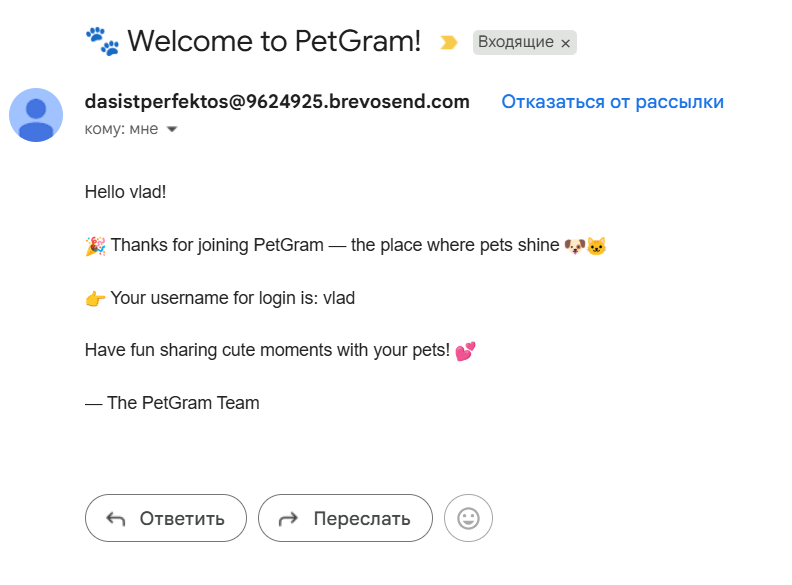

### 💸 Stripe Donation Flow
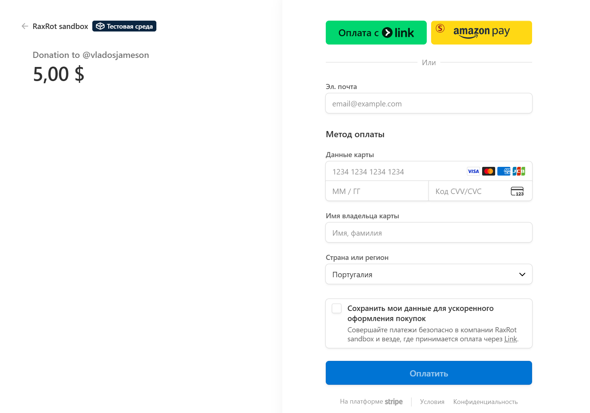

### 📬 Chat Between Users
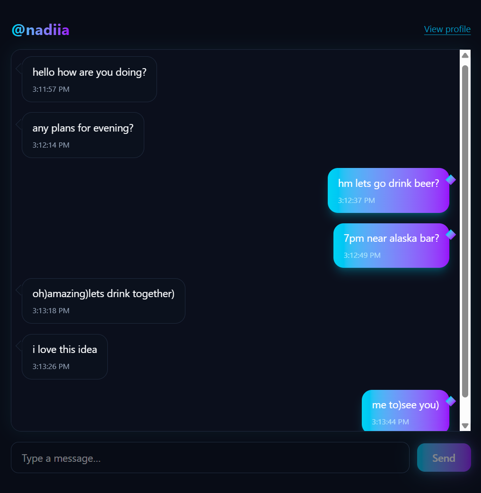

### 📰 Feed (Latest Posts)
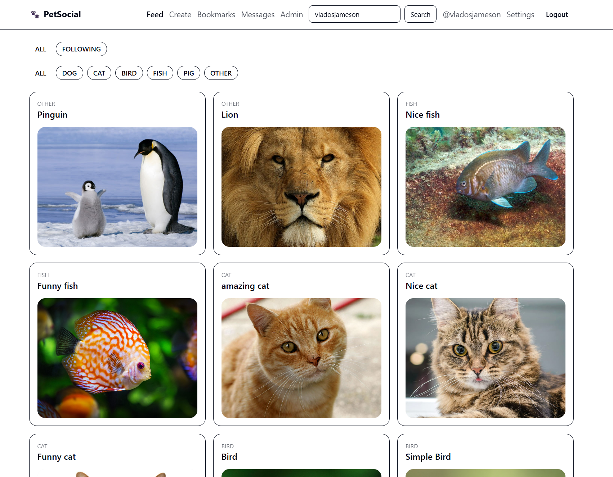

### 🐾 Post View (likes, comments, bookmark)
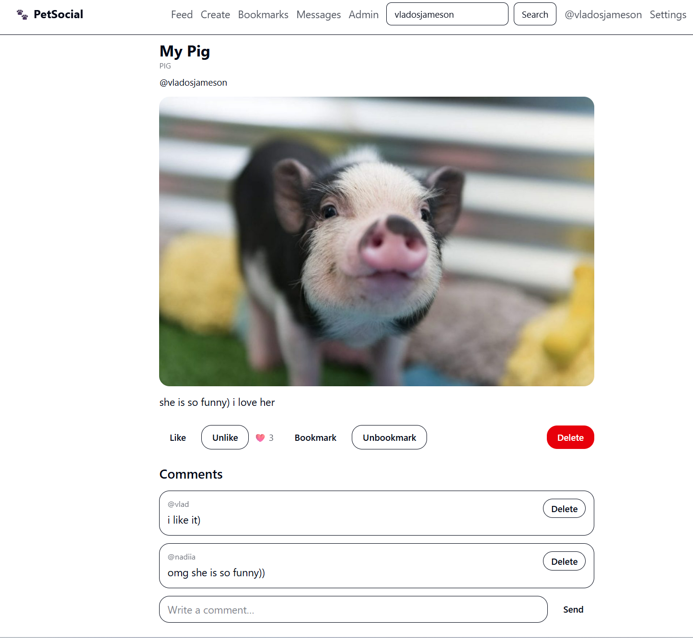

### ⚙️ Admin Panel (User management)
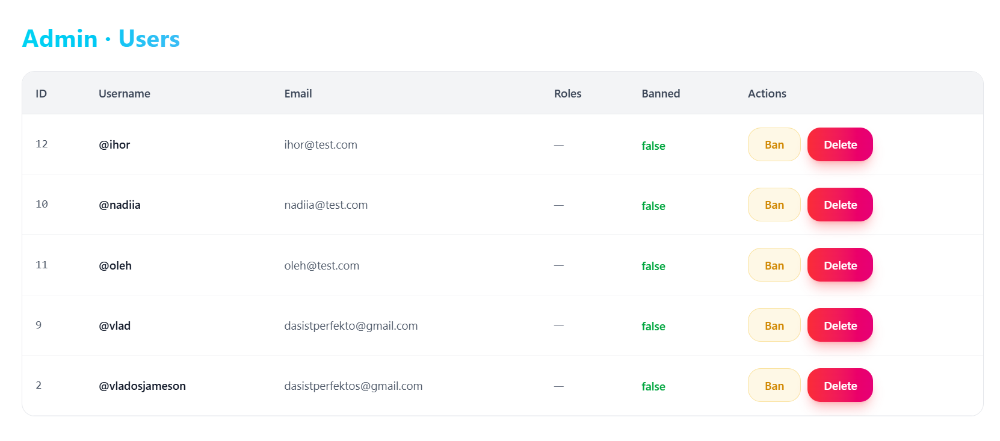

### 👤 User Profile
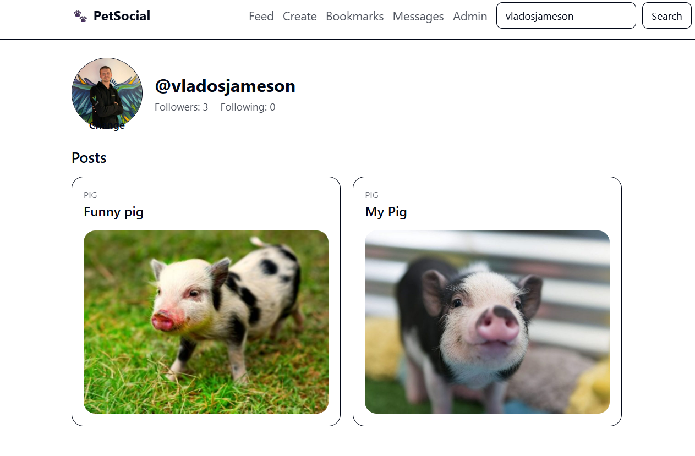

### ✍️ Create Post
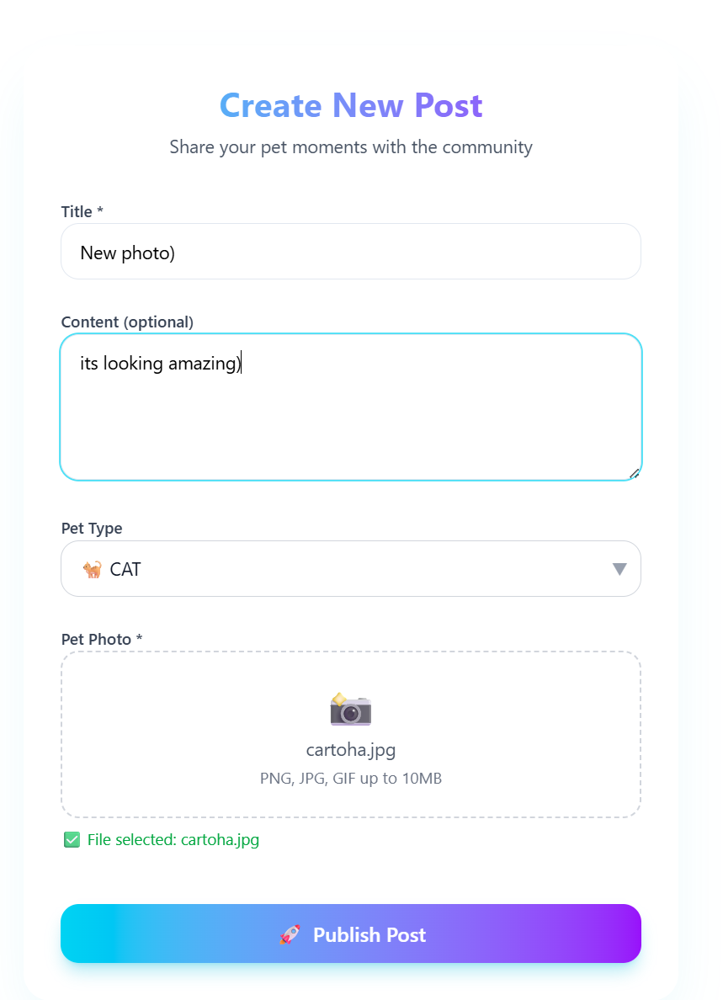

### 👤 User Profile (detailed)
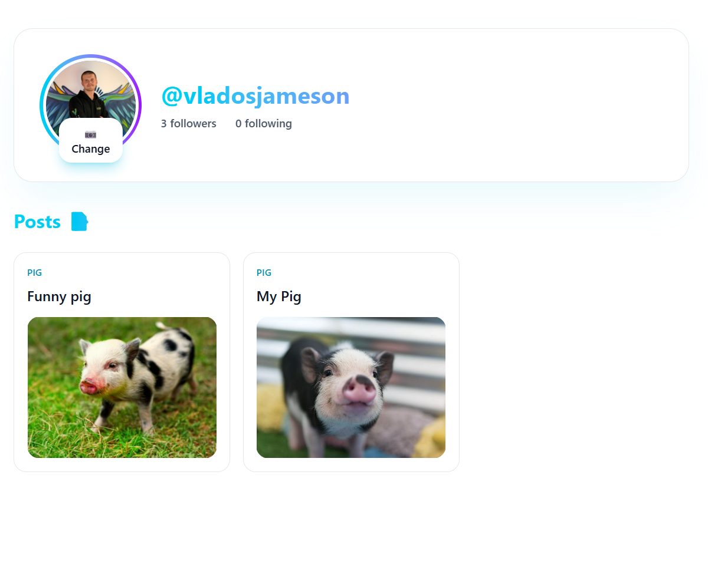

### 📝 Registration (form)
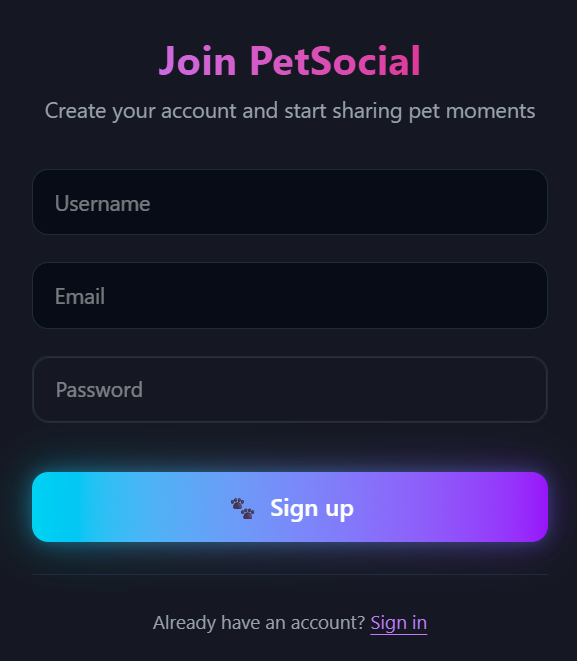

### 🔧 Account Settings
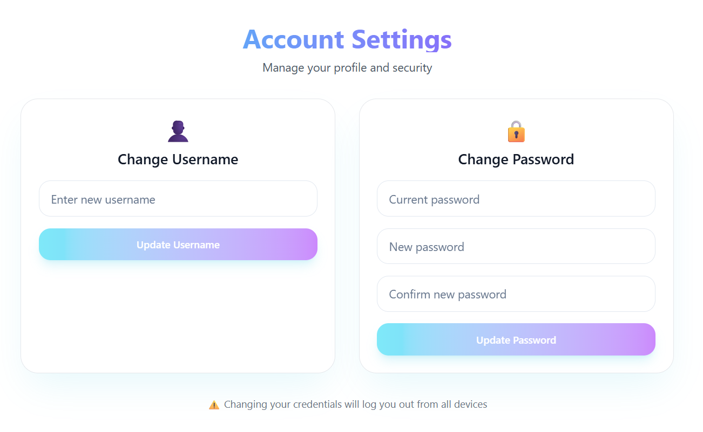

---

## 🛠 Tech Stack

- **Frontend:** React 18, TailwindCSS, React Query, React Router
- **Backend:** Spring Boot 3, Spring Security + JWT, Spring Data JPA (Hibernate)
- **Database:** MySQL
- **Storage:** AWS S3 (file uploads)
- **Payments:** Stripe API
- **Other:** ModelMapper, Lombok, JUnit 5

---

## ⚡ Features (Detailed)

### 🔐 Authentication & Authorization
- Login / Registration
- JWT in **HttpOnly cookies**
- Roles: `ROLE_USER`, `ROLE_ADMIN`
- Auto-refresh username after change
- Admin-only access for moderation

### 👤 User Management
- Profile picture upload (AWS S3)
- Change username / password
- Forgot username → reminder via email
- Ban / unban users (admin only)
- Delete users (with cascade cleanup of posts, likes, comments, chat, bookmarks)

### 📝 Posts & Feed
- Create posts with image + animal type (DOG, CAT, BIRD, FISH, PIG, OTHER)
- Browse posts with pagination & sorting
- Filter by username / animal type
- View post details (likes, comments, author info)
- Delete post (owner or admin)

### ❤️ Likes & 💬 Comments
- Like / Unlike posts
- Add / delete comments
- Admin can delete comments or ban author

### 🔖 Social Features
- Follow / Unfollow users
- Followers / Following counters
- Save posts to bookmarks
- View your saved posts

### 💸 Donations
- Stripe checkout for supporting authors
- Redirect to success/cancel pages
- Email notifications to both donor and author

### 📬 Private Chat
- One-on-one conversations
- Messages are stored in DB
- Real-time polling for new messages
- Auto-scroll to latest

### 📧 Email Service
- Registration confirmation
- Username reminder
- Donation notifications

### ⚙️ Admin Panel
- List users (pagination, filters)
- Ban / unban users
- Delete users (non-admin only)

---

## 🚀 Running Locally

```bash
git clone https://github.com/raxrot/pet-social.git
cd pet-social
./mvnw spring-boot:run
```

Frontend → start React dev server (`npm run dev`).  
Backend → runs on http://localhost:8080.

---

## 👩‍💻 Author

Made with ❤️ by [raxrot](https://github.com/RaxRot)  
Junior Backend Developer (Spring Boot, React)
